# Claude Code Hooks 使用指南

> Hooks 是 Claude Code 的生命周期钩子机制，让你在工具执行前后自动运行 shell 命令，实现确定性的自动化控制。

## 核心理念

**让模型专注于创造性工作，让 hooks 负责确定性工作。**

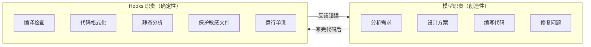

### 为什么用 hooks 而不是让模型自己判断？

| 对比项 | 靠模型判断 | 靠 hooks |
|--------|-----------|----------|
| **可靠性** | 不稳定，模型可能忘记或跳过 | 100% 触发，不会遗漏 |
| **成本** | 每次判断+执行消耗 tokens | 零 token 消耗，shell 直接执行 |
| **上下文** | 编译命令和输出占用 context window | 只有失败时才注入错误信息 |
| **速度** | 模型思考→决策→调用 Bash→等待，多轮交互 | 改完文件立即触发，无中间环节 |
| **一致性** | 不同模型、不同对话表现不同 | 团队统一，行为完全确定 |

---

## Hook 事件类型

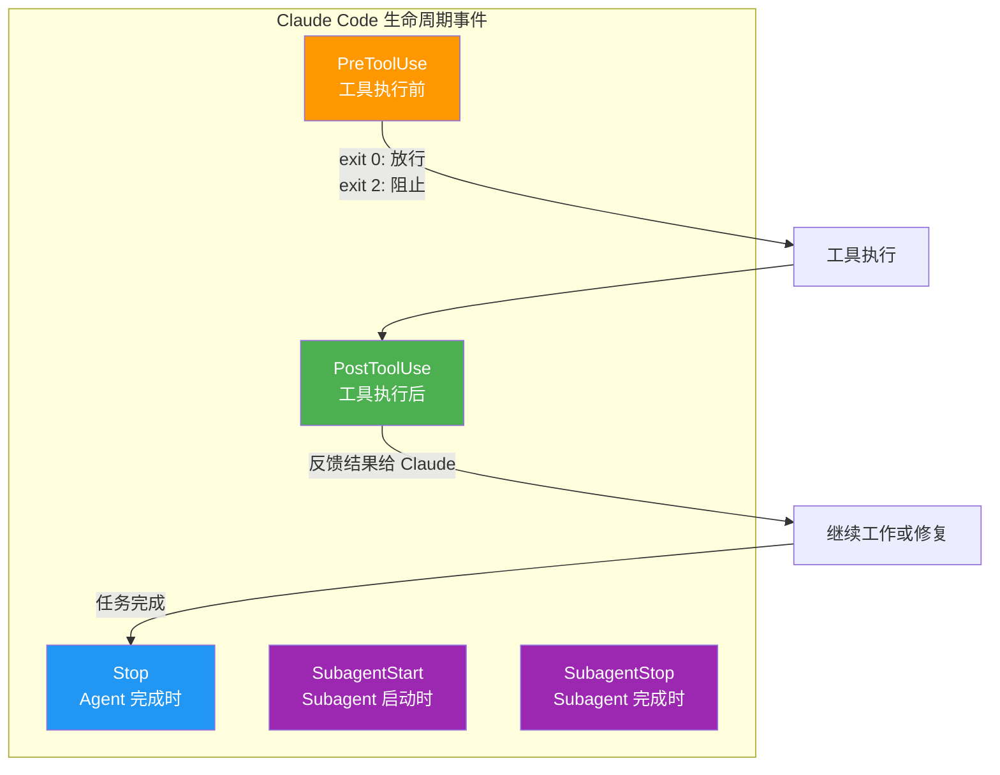

| 事件 | 触发时机 | matcher 输入 | 典型用途 |
|------|---------|-------------|---------|
| `PreToolUse` | 工具执行前 | 工具名称 | 拦截危险操作、验证命令 |
| `PostToolUse` | 工具执行后 | 工具名称 | 编译检查、格式化、跑测试 |
| `Stop` | Agent 完成时 | 无 | 生成报告、清理资源 |
| `SubagentStart` | Subagent 启动时 | Agent 类型名 | 初始化环境 |
| `SubagentStop` | Subagent 完成时 | Agent 类型名 | 清理资源、收集结果 |

---

## 退出码机制

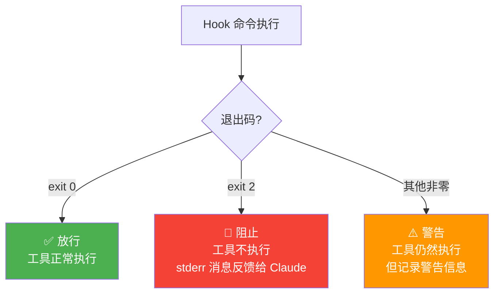

**关键**：只有 `exit 2` 能真正阻止工具执行，其他非零码只是警告。

---

## Hook 输出通道与 Claude 上下文注入

Hook 脚本有两个输出通道，Claude Code 对它们的处理方式取决于退出码：

```bash
echo "some message"        # → stdout (文件描述符 1)，默认输出通道
echo "some message" >&1    # → stdout (文件描述符 1)，与上面完全等价，>&1 是显式写法
echo "some message" >&2    # → stderr (文件描述符 2)，>&2 将输出重定向到 stderr
```

> **说明**：`echo` 默认输出到 stdout（fd 1），所以 `echo "msg"` 和 `echo "msg" >&1` 效果完全一样，`>&1` 平时无需显式写出。只有 `>&2` 需要显式指定，因为它改变了默认的输出方向。

### 输出通道与退出码的交互关系

| 输出通道 | exit 0（放行） | exit 2（阻止） |
|----------|---------------|---------------|
| **stdout** | 注入 Claude 上下文 | 注入 Claude 上下文 |
| **stderr** | 忽略 | **注入 Claude 上下文** |

> **核心要点**：stdout 的输出始终会注入 Claude 上下文；stderr 的输出只有在 exit 2（阻止）时才会注入。

### 四种组合场景详解

#### 场景 A：stdout + exit 0（放行 + 注入提醒）

**效果**：操作正常执行，stdout 输出注入 Claude 上下文作为提醒。

**用途**：在不阻止操作的前提下，向 Claude 传递提醒、建议或补充信息。

```bash
#!/bin/bash
# PostToolUse hook：编辑 Controller 后提醒更新 API 文档
INPUT=$(cat)
FILE=$(echo "$INPUT" | jq -r '.tool_input.file_path')

if echo "$FILE" | grep -qE 'Controller\.java$'; then
  echo "Reminder: $FILE has been modified. Please update the API documentation accordingly."
  # ↑ stdout 输出，exit 0 放行时会注入 Claude 上下文
fi

exit 0  # 放行，文件编辑正常生效
```

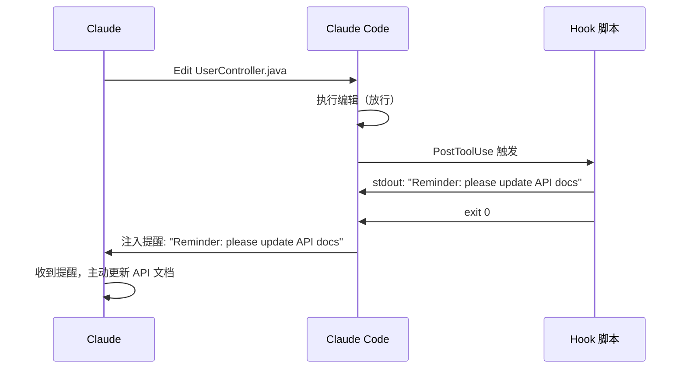

**更多示例：**

```bash
# SessionStart hook：会话启动时注入团队规范（动态系统提示词）
echo "Reminder: use Bun, not npm. Run bun test before committing. Current sprint: auth refactor."
exit 0
# → Claude 在会话开始时"读到"这段提醒，后续对话中会遵循这些约定

# PostToolUse hook：编译成功后告知结果
echo "Compilation successful. All 42 tests passed."
exit 0
# → Claude 知道编译通过，可以继续下一步工作

# PostToolUse hook：编辑文件后提醒缺少 Logger
echo "WARNING: UserService.java has no logger defined, consider adding one."
exit 0
# → Claude 收到提醒，可能会主动补充 Logger 定义
```

---

#### 场景 B：stdout + exit 2（阻止 + stdout 注入原因）

**效果**：操作被阻止，stdout 输出也会注入 Claude 上下文。

**用途**：技术上可行，但**不推荐**。阻止场景应使用 stderr 传递原因，语义更清晰。

```bash
#!/bin/bash
# ⚠️ 不推荐写法：用 stdout 传递阻止原因
INPUT=$(cat)
COMMAND=$(echo "$INPUT" | jq -r '.tool_input.command')

if echo "$COMMAND" | grep -q "drop table"; then
  echo "Blocked: dropping tables is not allowed"  # stdout 输出，exit 2 时也会注入
  exit 2  # 阻止操作
fi

exit 0
```

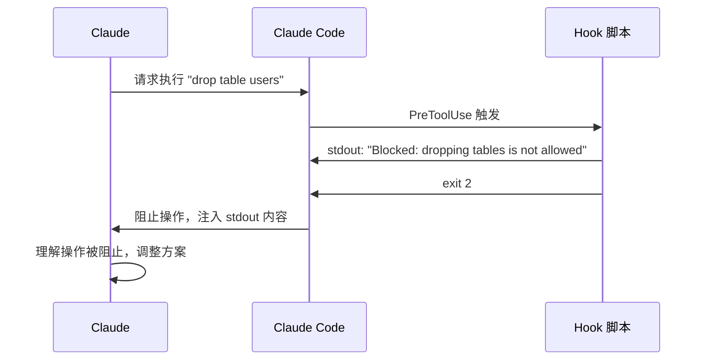

> **为什么不推荐？** 虽然 stdout 在 exit 2 时也能注入，但 stderr 是专门为错误/阻止信息设计的通道。使用 stderr（`>&2`）语义更明确，也便于日志排查。推荐改用场景 C 的写法。

---

#### 场景 C：stderr + exit 2（阻止 + stderr 注入原因）✅ 推荐

**效果**：操作被阻止，stderr 输出注入 Claude 上下文作为阻止原因。

**用途**：拦截危险操作并告知 Claude 原因，让 Claude 自适应调整方案。**这是阻止场景的标准写法。**

```bash
#!/bin/bash
# ✅ 推荐写法：用 stderr 传递阻止原因
INPUT=$(cat)
FILE=$(echo "$INPUT" | jq -r '.tool_input.file_path')

if echo "$FILE" | grep -qE 'application-prod\.yml'; then
  echo "Blocked: cannot modify production config file: $FILE" >&2
  # ↑ >&2 将输出重定向到 stderr，配合 exit 2 时会注入 Claude 上下文
  exit 2  # 阻止操作
fi

exit 0
```

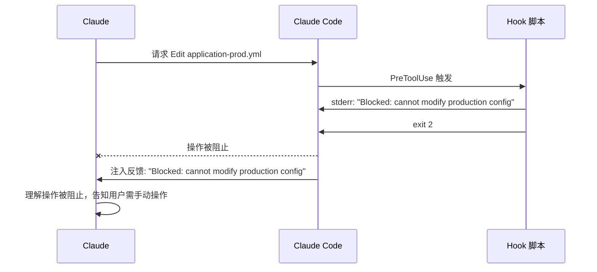

**更多示例：**

```bash
# 阻止破坏性 SQL
echo "Blocked: destructive SQL not allowed, use SELECT only" >&2 && exit 2

# 阻止操作生产环境
echo "Blocked: production environment operations not allowed" >&2 && exit 2

# 阻止不符合规范的 commit message
echo "Blocked: commit message must follow Conventional Commits format" >&2 && exit 2
```

---

#### 场景 D：stderr + exit 0（放行 + stderr 被忽略）

**效果**：操作正常执行，stderr 输出**被忽略**，Claude 不会看到。

**用途**：Hook 脚本自身的调试日志输出。不想让 Claude 看到，但开发者可以在终端或日志中查看。

```bash
#!/bin/bash
# stderr 在 exit 0 时不会注入 Claude 上下文，可用于调试
INPUT=$(cat)
FILE=$(echo "$INPUT" | jq -r '.tool_input.file_path')

echo "DEBUG: hook triggered for file: $FILE" >&2  # Claude 不会看到这条
# ↑ exit 0 时 stderr 被忽略，仅用于开发者调试

if echo "$FILE" | grep -qE '\.java$'; then
  echo "Java file detected, running compile check..."  # stdout → Claude 会看到
fi

exit 0  # 放行
```

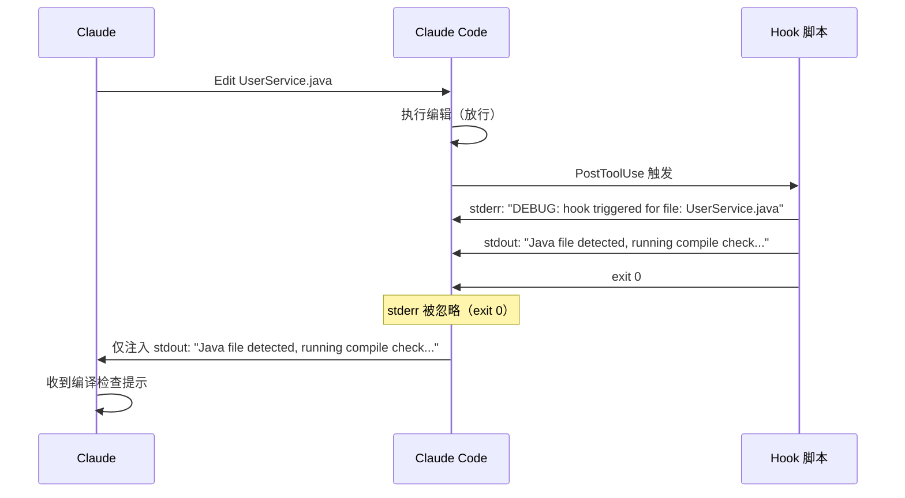

> **实用技巧**：利用 stderr + exit 0 被忽略的特性，可以在 hook 脚本中输出调试信息而不污染 Claude 的上下文。

---

### 选择原则总结

| 需求 | 推荐写法 | 对应场景 |
|------|---------|---------|
| 放行操作 + 向 Claude 传递提醒 | `echo "提醒内容"` + `exit 0` | 场景 A |
| 阻止操作 + 告知 Claude 原因 | `echo "原因" >&2` + `exit 2` | 场景 C ✅ |
| 输出调试日志，不让 Claude 看到 | `echo "调试信息" >&2` + `exit 0` | 场景 D |
| 阻止操作 + 用 stdout 传原因 | `echo "原因"` + `exit 2` | 场景 B（不推荐） |

> **本质**：stdout + exit 0 是"动态注入系统提示词"的机制；stderr + exit 2 是"阻止并反馈"的机制。两者结合让 Hook 既能控制行为，又能向 Claude 传递运行时上下文。

### 脚本示例详解

```bash
#!/bin/bash
INPUT=$(cat)                                            # ① 从 stdin 读取 JSON
COMMAND=$(echo "$INPUT" | jq -r '.tool_input.command')  # ② 提取工具调用的命令

if echo "$COMMAND" | grep -q "drop table"; then
  echo "Blocked: dropping tables is not allowed" >&2    # ③ stderr 输出反馈
  exit 2                                                # ④ 阻止操作
fi

exit 0                                                  # ⑤ 放行
```

**各步骤说明：**

1. **`INPUT=$(cat)`** — Hook 触发时，Claude Code 通过 stdin 传入 JSON（包含 `tool_name`、`tool_input` 等字段），`cat` 读取整个 JSON 存入变量
2. **`jq -r '.tool_input.command'`** — 从 JSON 中提取 Claude 想执行的实际 shell 命令字符串
3. **`echo "..." >&2`** — 将阻止原因输出到 stderr。配合 exit 2 使用时，这段文字会被注入到 Claude 的对话上下文中，Claude 会"看到"这条消息并据此调整行为
4. **`exit 2`** — 阻止工具执行，Claude 收到 stderr 反馈后理解操作被拒绝
5. **`exit 0`** — 命令安全，放行执行

### 完整流程示意

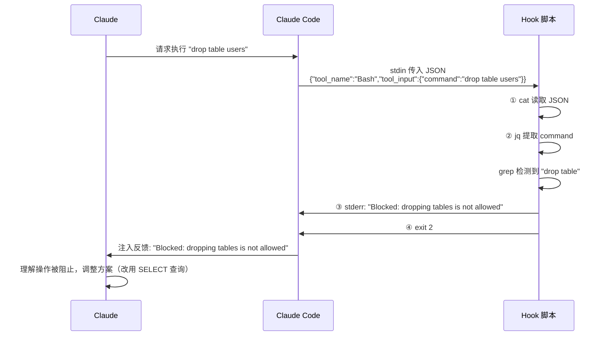

> **本质**：Hook 的 stderr + exit 2 机制提供了一种**动态向 Claude 注入上下文反馈**的能力，让 Claude 能够根据运行时的实际情况自适应调整行为，而不仅仅是简单地阻止操作。

---

## Hook 输入数据（stdin JSON）

Claude Code 通过 stdin 向 hook 命令传入 JSON 数据：

### PreToolUse 输入

```json
{
  "tool_name": "Bash",
  "tool_input": {
    "command": "rm -rf /tmp/test"
  }
}
```

### PostToolUse 输入

```json
{
  "tool_name": "Edit",
  "tool_input": {
    "file_path": "src/main/java/com/example/UserService.java",
    "old_string": "...",
    "new_string": "..."
  },
  "tool_output": "File updated successfully"
}
```

用 `jq` 提取字段：

```bash
# 提取文件路径
jq -r '.tool_input.file_path'

# 提取 Bash 命令
jq -r '.tool_input.command'

# 提取工具名称
jq -r '.tool_name'
```

---

## 配置位置

Hooks 可以配置在两个地方：

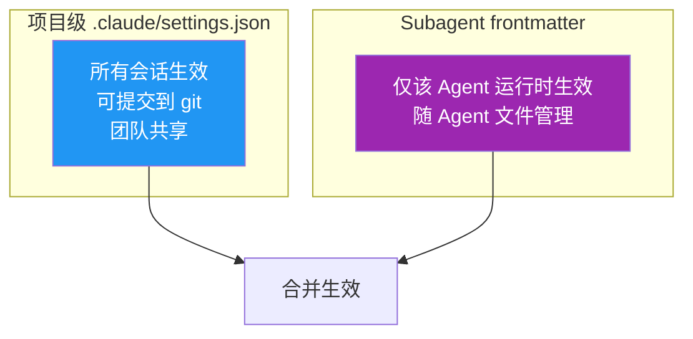

### 项目级配置（settings.json）

```json
{
  "hooks": {
    "PreToolUse": [...],
    "PostToolUse": [...],
    "SubagentStart": [...],
    "SubagentStop": [...]
  }
}
```

### Subagent 内配置（agent .md 文件）

```yaml
hooks:
  PreToolUse:
    - matcher: "Bash"
      hooks:
        - type: command
          command: "./scripts/validate.sh"
  PostToolUse:
    - matcher: "Edit|Write"
      hooks:
        - type: command
          command: "./scripts/lint.sh"
  Stop:
    - hooks:
        - type: command
          command: "./scripts/cleanup.sh"
```

---

## 实战场景

### 场景一：Java 自动编译检查

**痛点**：Claude 修改 Java 文件后可能不主动编译，直到最后才发现编译错误，浪费大量上下文修复。

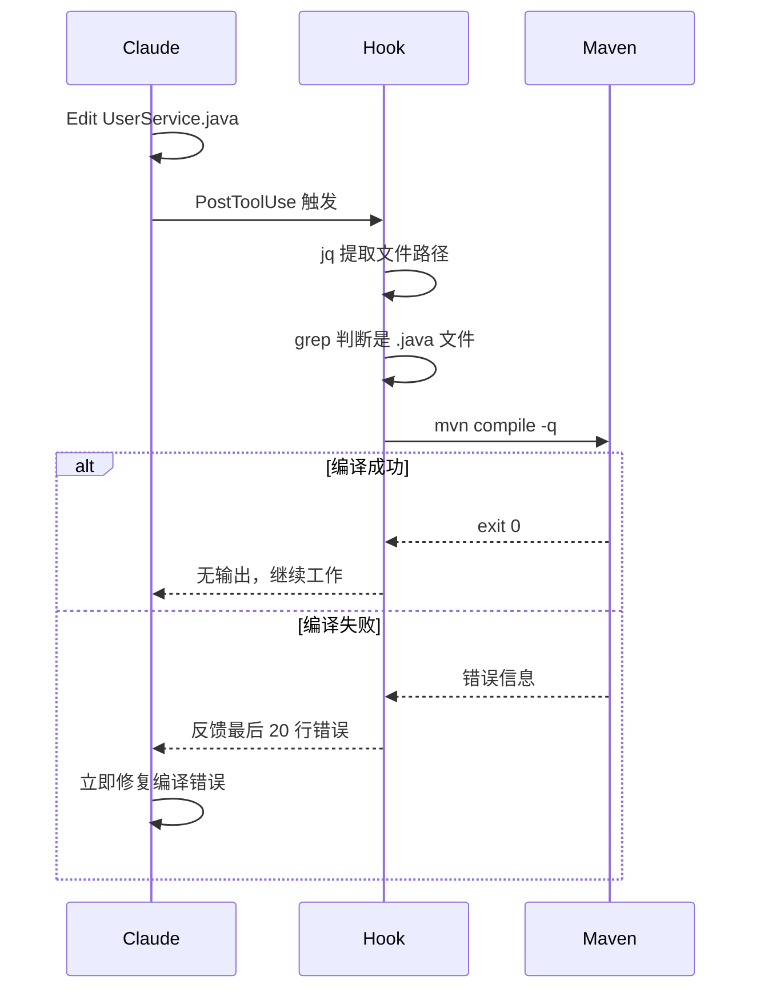

**配置：**

```json
{
  "hooks": {
    "PostToolUse": [
      {
        "matcher": "Edit|Write",
        "hooks": [
          {
            "type": "command",
            "command": "FILE=$(jq -r '.tool_input.file_path'); echo $FILE | grep -q '\\.java$' && mvn compile -q -f $(echo $FILE | sed 's|/src/.*|/pom.xml|') 2>&1 | tail -20 || exit 0"
          }
        ]
      }
    ]
  }
}
```

**命令拆解：**

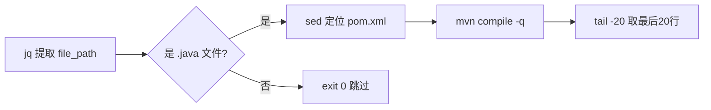

---

### 场景二：代码自动格式化

**痛点**：Claude 生成的代码风格可能与团队规范不一致。

#### Java 项目（google-java-format）

```json
{
  "hooks": {
    "PostToolUse": [
      {
        "matcher": "Edit|Write",
        "hooks": [
          {
            "type": "command",
            "command": "FILE=$(jq -r '.tool_input.file_path'); echo $FILE | grep -q '\\.java$' && google-java-format --replace \"$FILE\" || exit 0"
          }
        ]
      }
    ]
  }
}
```

#### 前端项目（Prettier）

```json
{
  "hooks": {
    "PostToolUse": [
      {
        "matcher": "Edit|Write",
        "hooks": [
          {
            "type": "command",
            "command": "jq -r '.tool_input.file_path' | xargs npx prettier --write"
          }
        ]
      }
    ]
  }
}
```

#### Spring Boot 项目（Spotless）

```json
{
  "hooks": {
    "PostToolUse": [
      {
        "matcher": "Edit|Write",
        "hooks": [
          {
            "type": "command",
            "command": "FILE=$(jq -r '.tool_input.file_path'); echo $FILE | grep -q '\\.java$' && mvn spotless:apply -q || exit 0"
          }
        ]
      }
    ]
  }
}
```

---

### 场景三：保护敏感文件

**痛点**：Claude 可能误改生产配置、安全配置、数据源配置等关键文件。

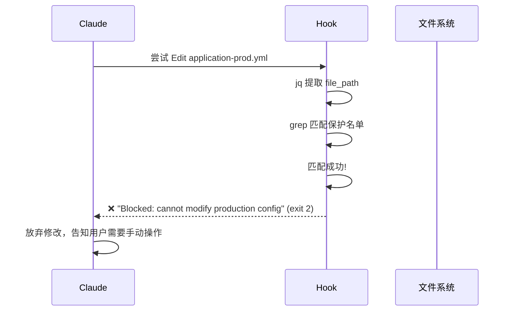

**配置：**

```json
{
  "hooks": {
    "PreToolUse": [
      {
        "matcher": "Edit|Write",
        "hooks": [
          {
            "type": "command",
            "command": "FILE=$(jq -r '.tool_input.file_path'); echo $FILE | grep -qE '(application-prod\\.yml|SecurityConfig\\.java|DataSourceConfig\\.java|\\.env)' && echo \"Blocked: cannot modify protected file: $FILE\" >&2 && exit 2 || exit 0"
          }
        ]
      }
    ]
  }
}
```

**可扩展为外部配置文件：**

```bash
#!/bin/bash
# scripts/check-protected-files.sh

FILE=$(jq -r '.tool_input.file_path')
PROTECTED_FILES="scripts/protected-files.txt"

if [ -f "$PROTECTED_FILES" ] && grep -qF "$FILE" "$PROTECTED_FILES"; then
  echo "Blocked: $FILE is a protected file" >&2
  exit 2
fi

exit 0
```

```text
# scripts/protected-files.txt
application-prod.yml
application-prod.properties
SecurityConfig.java
DataSourceConfig.java
.env
.env.production
```

---

### 场景四：SQL 安全防护

**痛点**：Claude 调试数据库时可能执行破坏性 SQL。

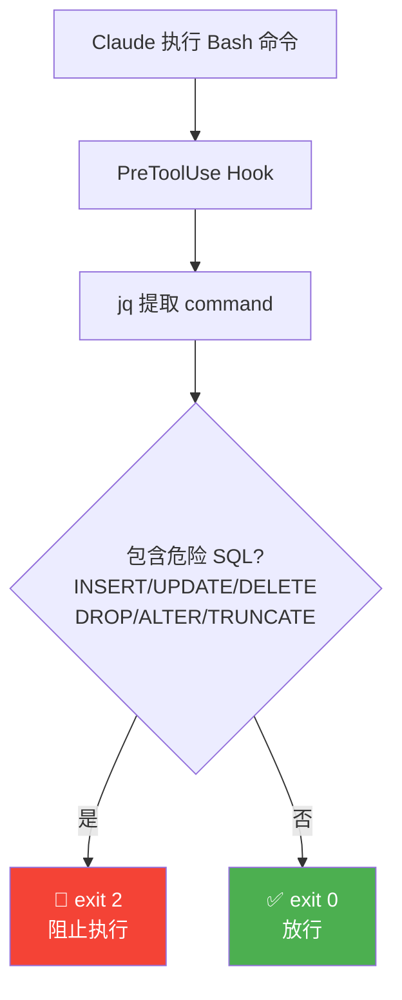

**配置：**

```json
{
  "hooks": {
    "PreToolUse": [
      {
        "matcher": "Bash",
        "hooks": [
          {
            "type": "command",
            "command": "CMD=$(jq -r '.tool_input.command'); echo $CMD | grep -iE '\\b(INSERT|UPDATE|DELETE|DROP|CREATE|ALTER|TRUNCATE|REPLACE|MERGE)\\b' > /dev/null && echo 'Blocked: destructive SQL not allowed, use SELECT only' >&2 && exit 2 || exit 0"
          }
        ]
      }
    ]
  }
}
```

---

### 场景五：自动运行单元测试

**痛点**：改了业务代码但没跑对应的单测，合并后才发现测试挂了。

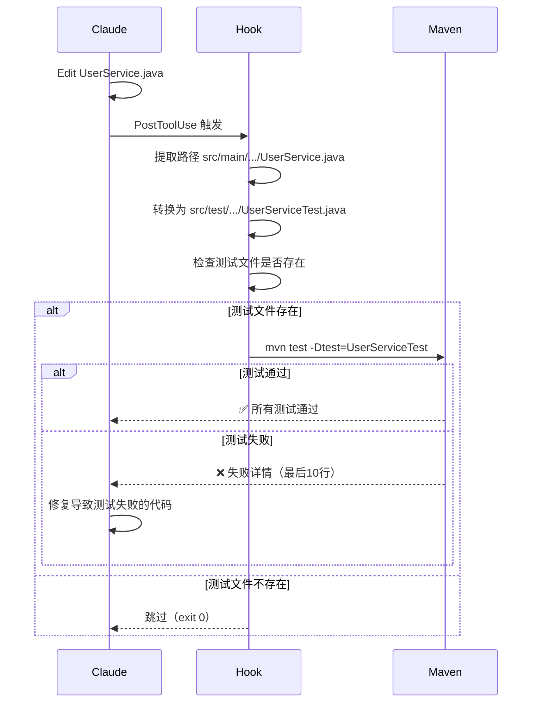

**配置：**

```json
{
  "hooks": {
    "PostToolUse": [
      {
        "matcher": "Edit|Write",
        "hooks": [
          {
            "type": "command",
            "command": "FILE=$(jq -r '.tool_input.file_path'); echo $FILE | grep -q 'src/main/.*\\.java$' && TEST_FILE=$(echo $FILE | sed 's|src/main|src/test|' | sed 's|\\.java$|Test.java|') && [ -f \"$TEST_FILE\" ] && mvn test -pl . -Dtest=$(basename $TEST_FILE .java) -q 2>&1 | tail -10 || exit 0"
          }
        ]
      }
    ]
  }
}
```

---

### 场景六：CheckStyle / SpotBugs 静态检查

**痛点**：代码风格违规在 CI 才发现，来回修复浪费时间。

```json
{
  "hooks": {
    "PostToolUse": [
      {
        "matcher": "Edit|Write",
        "hooks": [
          {
            "type": "command",
            "command": "FILE=$(jq -r '.tool_input.file_path'); echo $FILE | grep -q '\\.java$' && mvn checkstyle:check -q 2>&1 | grep -E '(ERROR|WARN)' | head -10 || exit 0"
          }
        ]
      }
    ]
  }
}
```

---

### 场景七：禁止操作生产环境

**痛点**：Claude 可能在命令中涉及生产环境的 SSH、部署等操作。

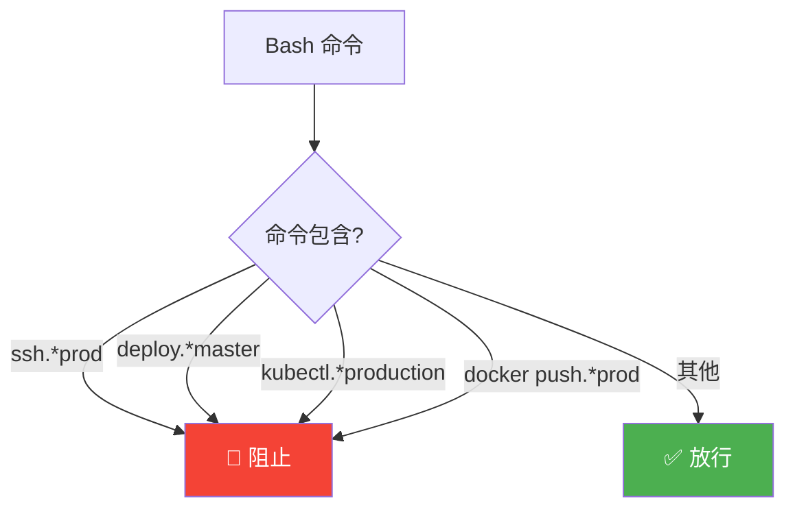

**配置：**

```json
{
  "hooks": {
    "PreToolUse": [
      {
        "matcher": "Bash",
        "hooks": [
          {
            "type": "command",
            "command": "CMD=$(jq -r '.tool_input.command'); echo $CMD | grep -iE '(ssh.*prod|deploy.*master|kubectl.*production|docker push.*prod|rsync.*prod)' && echo 'Blocked: production environment operations not allowed' >&2 && exit 2 || exit 0"
          }
        ]
      }
    ]
  }
}
```

---

### 场景八：Logger 检查提醒

**痛点**：新建的 Service/Controller 类缺少 Logger 定义。

```json
{
  "hooks": {
    "PostToolUse": [
      {
        "matcher": "Edit|Write",
        "hooks": [
          {
            "type": "command",
            "command": "FILE=$(jq -r '.tool_input.file_path'); echo $FILE | grep -qE '(Service|Controller|Repository)\\.java$' && ! grep -q 'private.*log' \"$FILE\" && echo \"WARNING: $FILE has no logger defined, consider adding: private static final Logger log = LoggerFactory.getLogger(ClassName.class);\" || exit 0"
          }
        ]
      }
    ]
  }
}
```

---

### 场景九：Git 提交规范检查

**痛点**：Claude 生成的 commit message 不符合团队约定（如 Conventional Commits）。

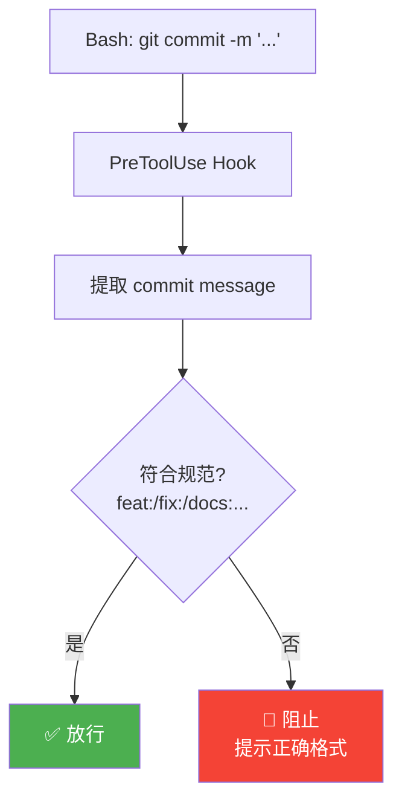

**配置：**

```json
{
  "hooks": {
    "PreToolUse": [
      {
        "matcher": "Bash",
        "hooks": [
          {
            "type": "command",
            "command": "CMD=$(jq -r '.tool_input.command'); echo $CMD | grep -q 'git commit' && MSG=$(echo $CMD | grep -oP '(?<=-m \").*?(?=\")') && echo $MSG | grep -qE '^(feat|fix|docs|style|refactor|test|chore|perf|ci|build|revert)(\\(.+\\))?: .+' || (echo 'Blocked: commit message must follow Conventional Commits format, e.g. feat(user): add login endpoint' >&2 && exit 2)"
          }
        ]
      }
    ]
  }
}
```

---

### 场景十：Subagent 生命周期管理

**痛点**：需要在 subagent 执行前后做环境准备和清理。

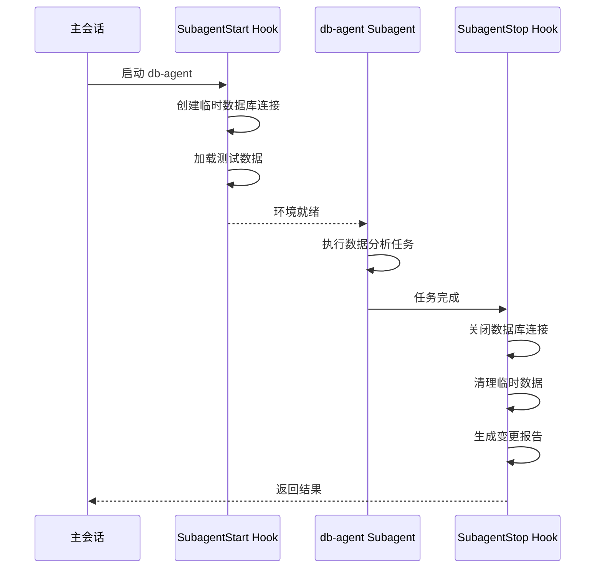

**配置（settings.json）：**

```json
{
  "hooks": {
    "SubagentStart": [
      {
        "matcher": "db-agent",
        "hooks": [
          {
            "type": "command",
            "command": "./scripts/setup-db-connection.sh"
          }
        ]
      }
    ],
    "SubagentStop": [
      {
        "matcher": "db-agent",
        "hooks": [
          {
            "type": "command",
            "command": "./scripts/cleanup-db-connection.sh"
          }
        ]
      },
      {
        "hooks": [
          {
            "type": "command",
            "command": "git diff --stat > .claude/change-report.txt"
          }
        ]
      }
    ]
  }
}
```

---

### 场景十一：API 接口变更通知

**痛点**：修改了 Controller 层接口但没有同步更新 API 文档或通知前端。

```json
{
  "hooks": {
    "PostToolUse": [
      {
        "matcher": "Edit|Write",
        "hooks": [
          {
            "type": "command",
            "command": "FILE=$(jq -r '.tool_input.file_path'); echo $FILE | grep -qE 'Controller\\.java$' && echo \"⚠️ API file changed: $FILE — remember to update API docs and notify frontend team\" || exit 0"
          }
        ]
      }
    ]
  }
}
```

---

### 场景十二：防止引入危险依赖

**痛点**：Claude 可能在 pom.xml 中引入不安全或不合规的依赖。

```json
{
  "hooks": {
    "PreToolUse": [
      {
        "matcher": "Edit|Write",
        "hooks": [
          {
            "type": "command",
            "command": "FILE=$(jq -r '.tool_input.file_path'); NEW=$(jq -r '.tool_input.new_string // empty'); echo $FILE | grep -q 'pom.xml' && echo $NEW | grep -qiE '(log4j-core.*1\\.|fastjson.*1\\.[0-2]|commons-collections.*3\\.)' && echo 'Blocked: this dependency has known vulnerabilities, use a newer version' >&2 && exit 2 || exit 0"
          }
        ]
      }
    ]
  }
}
```

---

## 组合配置示例

### Java 后端项目完整 hooks 配置

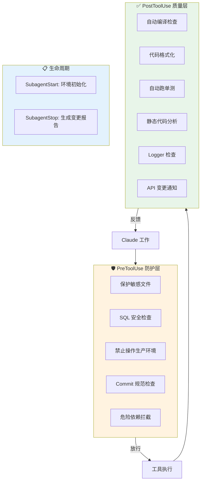

**完整 settings.json：**

```json
{
  "hooks": {
    "PreToolUse": [
      {
        "matcher": "Edit|Write",
        "hooks": [
          {
            "type": "command",
            "command": "FILE=$(jq -r '.tool_input.file_path'); echo $FILE | grep -qE '(application-prod\\.yml|SecurityConfig\\.java|DataSourceConfig\\.java|\\.env)' && echo \"Blocked: $FILE is protected\" >&2 && exit 2 || exit 0"
          }
        ]
      },
      {
        "matcher": "Bash",
        "hooks": [
          {
            "type": "command",
            "command": "CMD=$(jq -r '.tool_input.command'); echo $CMD | grep -iE '\\b(INSERT|UPDATE|DELETE|DROP|ALTER|TRUNCATE)\\b' > /dev/null && echo 'Blocked: destructive SQL not allowed' >&2 && exit 2 || exit 0"
          },
          {
            "type": "command",
            "command": "CMD=$(jq -r '.tool_input.command'); echo $CMD | grep -iE '(ssh.*prod|deploy.*master|kubectl.*production)' && echo 'Blocked: production operations not allowed' >&2 && exit 2 || exit 0"
          }
        ]
      }
    ],
    "PostToolUse": [
      {
        "matcher": "Edit|Write",
        "hooks": [
          {
            "type": "command",
            "command": "FILE=$(jq -r '.tool_input.file_path'); echo $FILE | grep -q '\\.java$' && mvn compile -q -f $(echo $FILE | sed 's|/src/.*|/pom.xml|') 2>&1 | tail -20 || exit 0"
          },
          {
            "type": "command",
            "command": "FILE=$(jq -r '.tool_input.file_path'); echo $FILE | grep -q '\\.java$' && google-java-format --replace \"$FILE\" || exit 0"
          }
        ]
      }
    ],
    "SubagentStop": [
      {
        "hooks": [
          {
            "type": "command",
            "command": "git diff --stat > .claude/change-report.txt 2>/dev/null || exit 0"
          }
        ]
      }
    ]
  }
}
```

---

## 编写 Hook 脚本的最佳实践

### 1. 始终处理非目标文件

```bash
# ✅ 正确：不匹配时 exit 0 放行
echo $FILE | grep -q '\.java$' && do_check || exit 0

# ❌ 错误：不匹配时可能意外阻止
echo $FILE | grep -q '\.java$' && do_check
```

### 2. 复杂逻辑抽到脚本文件

```bash
# ✅ 推荐：可维护、可测试
command: "./scripts/validate-command.sh"

# ❌ 避免：一行内塞太多逻辑难以调试
command: "FILE=$(jq -r '...'); echo $FILE | grep ... && ... | sed ... && ... || ..."
```

### 3. 控制输出量

```bash
# ✅ 只取关键信息
mvn compile -q 2>&1 | tail -20

# ❌ 全量输出淹没上下文
mvn compile
```

### 4. 用 stderr 传递阻止消息

```bash
# ✅ stderr 会反馈给 Claude
echo "Blocked: reason" >&2 && exit 2

# ❌ stdout 不会作为阻止原因展示
echo "Blocked: reason" && exit 2
```

### 5. 脚本文件记得加执行权限

```bash
chmod +x ./scripts/validate-command.sh
```

---

## 调试 hooks

### 查看 hook 是否触发

在 hook 中加日志输出：

```json
{
  "type": "command",
  "command": "echo \"$(date) - Hook fired for $(jq -r '.tool_name')\" >> /tmp/hooks-debug.log"
}
```

### 手动测试 hook 脚本

```bash
# 模拟 PreToolUse 输入
echo '{"tool_name":"Bash","tool_input":{"command":"DROP TABLE users"}}' | ./scripts/validate-command.sh
echo $?  # 应该输出 2（被阻止）

echo '{"tool_name":"Bash","tool_input":{"command":"SELECT * FROM users"}}' | ./scripts/validate-command.sh
echo $?  # 应该输出 0（放行）
```

---

## 按风险等级速查表

| 风险等级 | Hook 类型 | 场景 | 退出码 |
|---------|-----------|------|--------|
| 🔴 **防护** | PreToolUse + exit 2 | 禁改生产配置、禁破坏性 SQL、禁操作生产环境、拦截危险依赖 | exit 2 阻止 |
| 🟡 **质量** | PostToolUse | 自动编译、跑单测、CheckStyle、格式化 | exit 0（反馈结果） |
| 🔵 **提醒** | PostToolUse | 缺少 Logger、API 变更通知 | exit 0（输出提醒） |
| ⚪ **记录** | SubagentStop | 生成变更报告、操作日志 | exit 0 |

---

## 参考链接

- [Claude Code Hooks 官方文档](https://docs.anthropic.com/en/docs/claude-code/hooks)
- [Claude Code Subagents 官方文档](https://docs.anthropic.com/en/docs/claude-code/sub-agents)
- [Hook Events 输入格式](https://docs.anthropic.com/en/docs/claude-code/hooks#pretooluse-input)
- [退出码行为说明](https://docs.anthropic.com/en/docs/claude-code/hooks#exit-code-output)
